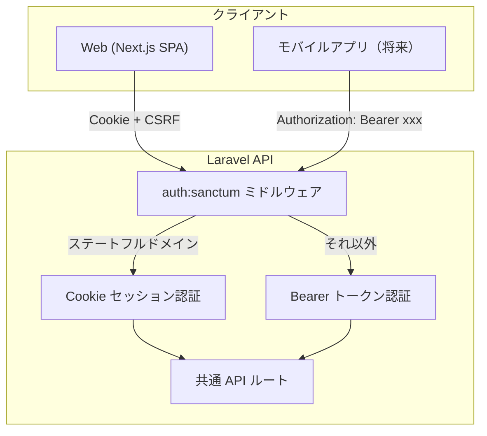
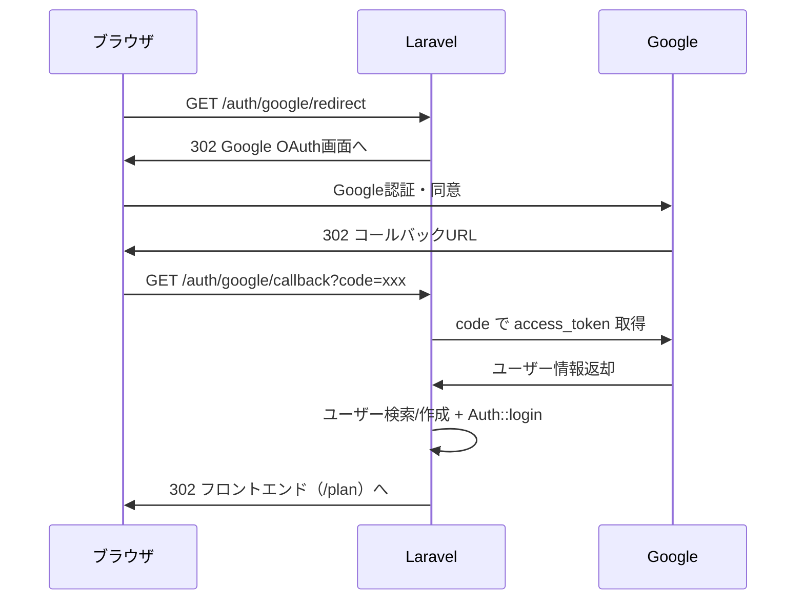

# Googleアカウントでのログイン実装プラン

## 認証アーキテクチャ方針（決定済み）

**ハイブリッド方式を採用:** Web は Cookie セッション、モバイルは Bearer トークン。



- Sanctum の `auth:sanctum` がリクエスト元に応じて Cookie/Bearer を自動切替するため、**API ルートは共通のまま**
- 現在の Web 実装は変更不要。モバイル対応時にトークン発行エンドポイントを追加するだけ
- Web で Cookie セッションを使う理由: HttpOnly Cookie は XSS 耐性が高く、SPA に最適

---

## 今回の実装スコープ: Web の Google ログイン

### フロー



### 新規ユーザーの扱い

新規登録も既存アカウント連携もどちらも対応する:

1. `social_accounts` テーブルで `provider=google` + `provider_id` で検索
2. **紐付け済みの場合:** そのユーザーでログイン
3. **紐付けなしの場合:** Google から返ってきた `email` で `users` テーブルを検索

- **既存ユーザーが見つかった:** `social_accounts` に紐付けを作成してログイン
- **見つからなかった:** 新規ユーザー + `social_accounts` を作成してログイン

1. Google 認証済みメールなので `**email_verified_at` を自動設定（メール認証スキップ）

---

## 実装の全体像

### サーバー側（Laravel）

#### 1. パッケージ追加

- `laravel/socialite` をインストール

#### 2. Google OAuth 設定

- [.env](server/.env) に `GOOGLE_CLIENT_ID`, `GOOGLE_CLIENT_SECRET`, `GOOGLE_REDIRECT_URI` を追加
- [config/services.php](server/config/services.php) に Google の設定を追加

```php
'google' => [
    'client_id' => env('GOOGLE_CLIENT_ID'),
    'client_secret' => env('GOOGLE_CLIENT_SECRET'),
    'redirect' => env('GOOGLE_REDIRECT_URI'),
],
```

#### 3. ER 図更新

- [server/docs/er.puml](server/docs/er.puml) を更新:
  - `social_accounts` エンティティを追加
  - `users` から `provider`, `provider_id` を削除（別テーブルに移行）
  - `users.password` の nullable 化を反映
  - `social_accounts` と `users` のリレーションを追加

#### 4. DB マイグレーション

`social_accounts` テーブルを新規作成:

```
social_accounts
  - id (uuid, PK)
  - user_id (uuid, FK -> users.id, ON DELETE CASCADE)
  - provider (string) -- "google", "apple", "line" 等
  - provider_id (string) -- プロバイダ側のユーザーID
  - created_at, updated_at
  - UNIQUE(provider, provider_id)
```

`users` テーブルの変更:

- `password` カラムを **nullable** に変更（ソーシャルログインのみで登録したユーザーはパスワード不要）

#### 5. モデル作成・更新

- `SocialAccount` モデルを新規作成（`provider`, `provider_id`, `user_id`）
- [app/Models/User.php](server/app/Models/User.php) に `socialAccounts()` リレーション（hasMany）を追加

#### 6. コントローラ作成

- `SocialLoginController` を新規作成
  - `redirectToGoogle()`: Socialite で Google へリダイレクト
  - `handleGoogleCallback()`: コールバック処理（`social_accounts` 検索/作成 + ユーザー検索/作成 + ログイン + フロントへリダイレクト）

#### 7. ルート追加

- [routes/auth.php](server/routes/auth.php) に追加:

```php
Route::get('/auth/google/redirect', [SocialLoginController::class, 'redirectToGoogle']);
Route::get('/auth/google/callback', [SocialLoginController::class, 'handleGoogleCallback']);
```

### クライアント側（Next.js）

#### 8. ログインページのボタン更新

- [client/src/app/(auth)/login/page.tsx](<client/src/app/(auth)/login/page.tsx>) の Google ボタンを `<a>` タグまたは `window.location.href` で Laravel の `/auth/google/redirect` へ遷移するように変更

#### 9. 登録ページのボタン更新

- [client/src/app/(auth)/register/page.tsx](<client/src/app/(auth)/register/page.tsx>) も同様に更新

---

## 将来のモバイル対応時に追加するもの（今回はスコープ外）

モバイルアプリ対応時には以下のエンドポイントを追加するだけで、既存の API ルートは変更不要:

- `POST /api/auth/login` -- メール/パスワードで Bearer トークン発行
- `POST /api/auth/google` -- Google ID Token を受け取り、検証して Bearer トークン発行
- `POST /api/auth/logout` -- トークン無効化

---

## 考慮事項

- **既存ユーザーとの email 衝突:** 同じメールアドレスで通常登録済みのユーザーが Google ログインした場合、自動連携して `social_accounts` に紐付け
- **Google Cloud Console での設定:** OAuth 2.0 クライアント ID の作成、リダイレクト URI の登録が事前に必要
- **CORS / Cookie:** リダイレクト方式なのでブラウザが直接 Laravel にアクセスするため、CORS の問題は発生しない
- **ログアウト:** 既存のログアウト処理はそのまま使える（セッション破棄のみ）
- **アカウント設定画面:** 将来的に Google 連携の解除/紐付け機能を設定画面に追加することも検討
