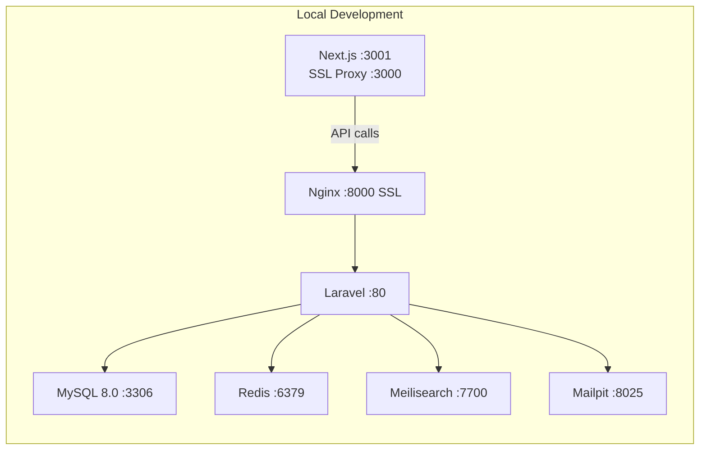
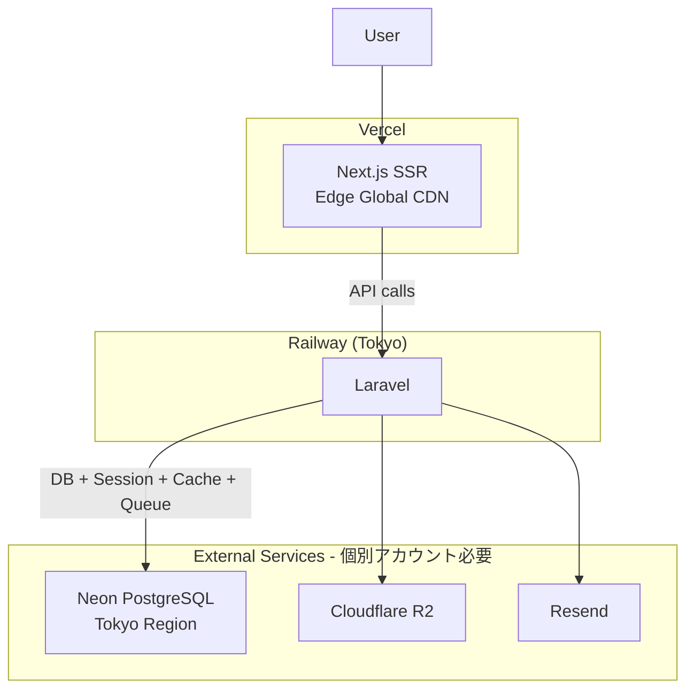
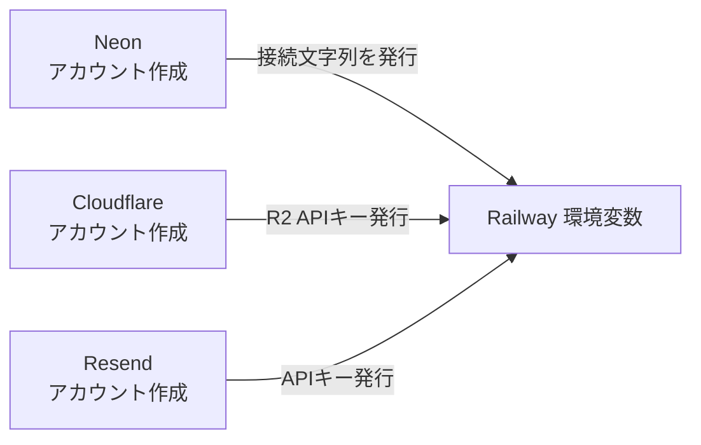

# MEAP デプロイ構成計画（PostgreSQL前提）

## 現状の構成

- フロントエンド: Next.js 14 (App Router) / SSR + クライアントサイド両方でAPI呼び出し
- バックエンド: Laravel 11 / Nginx + PHP 8.3 / Laravel Sail (Docker)
- DB: MySQL 8.0 / Redis / Meilisearch（設定のみ、未使用）
- 認証: Laravel Sanctum（Cookie + CSRF トークン）
- ストレージ: ローカルディスク（S3設定済みだが未使用）
- Next.js API Routes: なし（全てLaravel APIに依存）

---

## 決定構成: Vercel + Railway + Neon

### 選定理由

- **Vercel**: Next.js App Routerとの相性が最高。グローバルCDNで海外ユーザーにもフロントの表示が速い
- **Railway**: セットアップが最も簡単（GitHub連携で自動デプロイ）。運用の手間が最小
- **Neon**: 将来Fly.ioに移行してもDB移行不要。マルチリージョンRead Replica対応。無料枠0.5GB

### Redis（Upstash）は初期構成では不要

現在のアプリはセッション・キャッシュ・キューの全てが `database` ドライバで動作しており、Redisは使っていない。初期リリースではNeon（PostgreSQL）に全て任せ、パフォーマンスが問題になった段階でUpstash（Redis）を追加する。追加時は `.env` の3行変更のみ（`SESSION_DRIVER=redis`, `CACHE_STORE=redis`, `QUEUE_CONNECTION=redis`）。

### サービス一覧と月額

| 役割           | サービス         | 月額目安        | 備考                                                        |
| -------------- | ---------------- | --------------- | ----------------------------------------------------------- |
| フロントエンド | Vercel Hobby/Pro | $0 ~ $20        | Next.js最適。SSR + middleware対応                           |
| バックエンド   | Railway          | $5 ~ $15        | Docker対応。Nginxは不要（Railway内蔵プロキシ）              |
| DB             | Neon (Free)      | $0              | PostgreSQL。0.5GB無料。セッション・キャッシュ・キューも兼務 |
| ストレージ     | Cloudflare R2    | $0 ~            | S3互換。エグレス無料。10GB無料                              |
| メール         | Resend           | $0              | 月100通無料。本番メール送信用                               |
| **合計**       |                  | **$5 ~ $35/月** |                                                             |

### 重要: 各サービスは独立したアカウント

RailwayがNeon/R2/Resendを提供するわけではない。それぞれ個別にアカウント登録し、発行された接続情報をRailwayの環境変数に設定する。

---

## 海外展開のスケーリング戦略

DBにNeonを選ぶことで、アプリ側（Railway/Fly.io）の移行時にDB移行が不要になる。段階的にインフラを拡張できる。

```mermaid
graph TB
  subgraph stage1 ["Stage 1: 初期リリース（日本ユーザーがメイン）"]
    S1Vercel["Vercel Edge Global"]
    S1Railway["Railway Laravel - Tokyo"]
    S1Neon["Neon PostgreSQL - Tokyo"]
  end
  S1Vercel --> S1Railway
  S1Railway --> S1Neon

  subgraph stage2 ["Stage 2: 海外ユーザー増加"]
    S2Vercel["Vercel Edge Global"]
    S2Railway["Railway Laravel - Tokyo"]
    S2NeonPrimary["Neon Primary - Tokyo"]
    S2NeonReplica["Neon Read Replica - US East"]
  end
  S2Vercel --> S2Railway
  S2Railway -->|"Write"| S2NeonPrimary
  S2Railway -->|"Read"| S2NeonReplica
  S2NeonPrimary -->|"Replication"| S2NeonReplica

  subgraph stage3 ["Stage 3: APIレイテンシが問題になったら"]
    S3Vercel["Vercel Edge Global"]
    S3FlyTokyo["Fly.io Laravel - Tokyo"]
    S3FlyUS["Fly.io Laravel - US East"]
    S3NeonPrimary2["Neon Primary - Tokyo"]
    S3NeonReplica2["Neon Read Replica - US East"]
  end
  S3Vercel --> S3FlyTokyo
  S3Vercel --> S3FlyUS
  S3FlyTokyo --> S3NeonPrimary2
  S3FlyUS -->|"Write"| S3NeonPrimary2
  S3FlyUS -->|"Read"| S3NeonReplica2
```

- **Stage 1**: Railway + Neon（東京）。Vercelがグローバルにフロントを配信するため、海外ユーザーもページ表示は速い。遅いのはクライアントサイドAPI呼び出しのみ
- **Stage 2**: NeonにRead Replicaを追加するだけ。Railwayはそのまま。Laravelの標準read/write分離設定で対応可能
- **Stage 3**: Fly.ioに移行。Neonの接続先はそのまま（`DATABASE_URL` 変更不要）。必要になるまでやらなくてよい

多くの個人開発アプリはStage 1 ~ 2で十分。Fly.ioへの移行は「必要になったらやる」で問題ない。

---

## 実装タスク

### 1. PostgreSQL移行（ローカル環境）

変更対象ファイル:

- [server/docker-compose.yml](server/docker-compose.yml) -- MySQLサービスをPostgreSQLに置き換え、phpMyAdminを削除またはpgAdminに置き換え
- [server/.env.example](server/.env.example) -- `DB_CONNECTION=pgsql`、ポート `5432`、charset等の変更
- [server/docker/nginx/conf.d/phpmyadmin.conf](server/docker/nginx/conf.d/phpmyadmin.conf) -- pgAdmin用に変更または削除
- [server/docker/mysql/create-testing-database.sh](server/docker/mysql/create-testing-database.sh) -- PostgreSQL用のテストDB作成スクリプトに変更

マイグレーション修正（ENUM -> string）:

- [server/database/migrations/2025_06_08_202415_create_recipes_table.php](server/database/migrations/2025_06_08_202415_create_recipes_table.php) -- `enum('status', ...)` -> `string('status')`
- [server/database/migrations/2025_06_08_205356_create_ingredient_units_table.php](server/database/migrations/2025_06_08_205356_create_ingredient_units_table.php) -- `enum('position', ...)` -> `string('position')`
- [server/database/migrations/2026_01_11_113417_create_published_recipe_ingredient_mappings_table.php](server/database/migrations/2026_01_11_113417_create_published_recipe_ingredient_mappings_table.php) -- `enum('unit_position', ...)` -> `string('unit_position')`

Raw SQL修正:

- [server/app/Services/RecipeService.php](server/app/Services/RecipeService.php) -- `orderByRaw` のNULL順序を `NULLS LAST` / `NULLS FIRST` に変更

### 2. 本番用Dockerfile作成（バックエンド）

- [server/docker/8.3/Dockerfile](server/docker/8.3/Dockerfile) を本番用として新規作成（既存の `Dockerfile.local` をベースに、xdebug/pcov等の開発用拡張を除外、Nginx統合、`php artisan serve` の代わりに php-fpm + nginx を使用）

### 3. 外部サービスのセットアップ（個別アカウント作成）

| サービス      | やること                                                                      | Railwayに設定する環境変数                                                                                         |
| ------------- | ----------------------------------------------------------------------------- | ----------------------------------------------------------------------------------------------------------------- |
| Neon          | neon.tech でアカウント作成 -> 東京リージョンでDB作成 -> 接続文字列コピー      | `DB_CONNECTION=pgsql`, `DB_HOST`, `DB_PORT`, `DB_DATABASE`, `DB_USERNAME`, `DB_PASSWORD`（または `DATABASE_URL`） |
| Cloudflare R2 | Cloudflareダッシュボードでアカウント作成 -> R2バケット作成 -> APIトークン発行 | `AWS_ACCESS_KEY_ID`, `AWS_SECRET_ACCESS_KEY`, `AWS_BUCKET`, `AWS_ENDPOINT`, `AWS_URL`                             |
| Resend        | resend.com でアカウント作成 -> APIキー発行 -> 送信ドメイン認証                | `MAIL_MAILER=resend`, `RESEND_API_KEY`                                                                            |

> **将来Redis（Upstash）が必要になった場合**: upstash.com でアカウント作成 -> Redisデータベース作成 -> `REDIS_HOST`, `REDIS_PORT`, `REDIS_PASSWORD` をRailway環境変数に追加 -> `.env` で `SESSION_DRIVER=redis`, `CACHE_STORE=redis`, `QUEUE_CONNECTION=redis` に変更

### 4. Vercelデプロイ設定（フロントエンド）

- [client/next.config.js](client/next.config.js) -- `images.remotePatterns` に本番バックエンドURLを追加
- Vercelダッシュボードで環境変数を設定:
  - `NEXT_PUBLIC_BACKEND_URL` = Railway上のLaravel URL
  - `NEXT_PUBLIC_FRONT_URL` = Vercelのドメイン

### 5. Railway設定（バックエンド）

- `railway.json` または Railway ダッシュボードで設定
- 上記「3. 外部サービスのセットアップ」で取得した接続情報を環境変数に設定
- その他の環境変数: `APP_URL`, `FRONTEND_URL`, `APP_ENV=production`, `APP_DEBUG=false` 等

### 6. 認証（Sanctum）のCORS/Cookie設定

現在の認証はSanctumのCookie認証（SPA認証）を使用。フロントとバックエンドが別ドメインになるため:

- [server/config/cors.php](server/config/cors.php) -- `allowed_origins` にVercelドメインを追加
- [server/config/sanctum.php](server/config/sanctum.php) -- `stateful` にVercelドメインを追加
- `.env` -- `SESSION_DOMAIN`, `SANCTUM_STATEFUL_DOMAINS` の設定
- 同一ドメインにできない場合、SPA認証からトークン認証への切り替えを検討

### 7. ストレージ設定

- `.env` -- `FILESYSTEM_DISK=s3`（Cloudflare R2はS3互換）
- [server/config/filesystems.php](server/config/filesystems.php) -- R2用のエンドポイント設定
