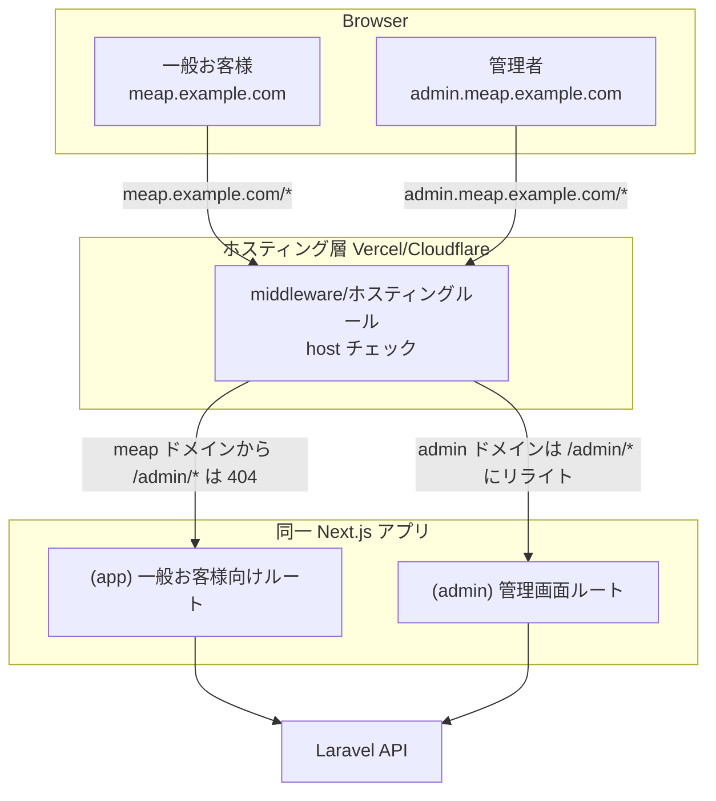
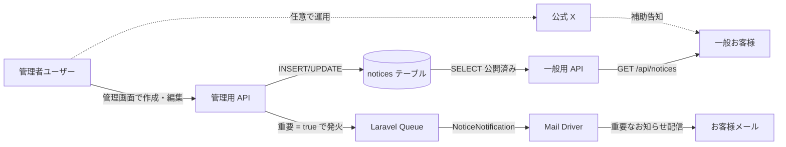

# お知らせ機能 実装計画

## 1. 全体構成

### 1.1 ドメイン・アクセス制御

### 1.2 お知らせ配信フロー

## 2. データモデル

`server/database/migrations/2026_XX_XX_create_notices_table.php` を新規作成。

- `id` bigint
- `type` enum（`general`, `regulation_change`, `feature`, `maintenance`）
- `title` string
- `body` text（マークダウン格納）
- `importance` enum（`minor`, `medium`, `important`）
- `published_at` datetime nullable（NULL は下書き、未来日時は予約公開）
- `email_sent_at` datetime nullable（メール送信記録）
- `created_at`, `updated_at`, `deleted_at`

`server/database/migrations/2026_XX_XX_add_is_admin_to_users_table.php` で `users.is_admin` ブール値を追加（個人開発のため最小構成、管理者は自分自身を Seeder か手動 UPDATE で設定）。

## 3. 実装項目

### サーバー側（[server/](server/)）

- `app/Models/Notice.php`（新規）
- `app/Http/Controllers/Api/NoticeController.php`（一般用：一覧・詳細）
- `app/Http/Controllers/Api/Admin/NoticeController.php`（管理用：CRUD・メール送信トリガ）
- `app/Http/Middleware/IsAdmin.php`（`users.is_admin` チェック）
- `app/Notifications/NoticeNotification.php`（[CustomVerifyEmailNotification.php](server/app/Notifications/Auth/CustomVerifyEmailNotification.php) を参考）
- `app/Jobs/SendNoticeEmailJob.php`（全お客様への一括送信、Queue 経由でチャンク送信）
- ルーティング：`routes/api.php` に一般用と `admin/` プレフィックスの管理用を追加
- 既存 [jobs テーブル](server/database/migrations/0001_01_01_000002_create_jobs_table.php) を流用してメール送信を非同期化

### フロント側（[client/src/app/](client/src/app/)）

- `(app)/notices/page.tsx`（お知らせ一覧）
- `(app)/notices/[id]/page.tsx`（お知らせ詳細）
- ヘッダーにお知らせアイコンリンク追加（[Header.tsx](client/src/components/Header.tsx) 等を編集）。未読バッジは `localStorage` に最終閲覧日時を保存して新着件数を表示する軽量実装
- `(admin)/layout.tsx`（管理者ガード、サブドメイン host チェックも併用）
- `(admin)/notices/page.tsx`（管理用一覧）
- `(admin)/notices/new/page.tsx`、`(admin)/notices/[id]/edit/page.tsx`（作成・編集）
- マークダウンレンダリング：`react-markdown` を導入。エディタは textarea + プレビューの簡素構成
- 管理画面用の重いライブラリ（`react-markdown`、エディタ等）は `next/dynamic` を用い `ssr: false` で動的 import し、一般お客様向けバンドルから完全に分離

### ホスティング層

- サブドメイン `admin.meap.example.com` を `meap.example.com/admin/*` へリライト
- `meap.example.com` ドメインから `/admin/*` への直接アクセスは **404 を返す**（管理画面のバンドルが配信されないようにする）
- 設定先：Vercel の `vercel.json`、または Cloudflare の Workers/Pages Function 等
- `client/middleware.ts`（Next.js Middleware）でも host チェックを補完し、host が `admin.`* 以外の場合に `/admin/`* を 404 にする

### サーバー側のドメイン設定

- Laravel API の CORS 設定（`config/cors.php`）に `https://admin.meap.example.com` を追加
- Sanctum 等のセッション設定で、`SESSION_DOMAIN=.meap.example.com` のようにサブドメイン共有設定（管理者ログインを共通ドメインで使い回す場合）

### テスト

- `server/tests/Feature/Api/NoticeControllerTest.php`（一般・管理 API）
- `server/tests/docs/03_Api/` に [既存仕様書](server/tests/docs/03_Api/01_ImageController_TEST_SPECIFICATIONS.md) と同形式でテスト仕様書を追加

## 4. 運用イメージ

### 管理者視点（自分）

1. ブラウザで `admin.meap.example.com` にアクセス → ログイン（既存ログイン基盤を流用、Cookie はサブドメイン共有）
2. ログイン後、管理画面トップへ。`is_admin = false` の場合は 403 リダイレクト
3. 「お知らせ作成」ボタン → タイトル、本文（マークダウン）、種別、重要度、公開日時を入力
4. 重要度が `important` の場合、保存時にメール送信ジョブが Queue に積まれて全お客様に配信
5. 公開後でも編集・削除可能。修正履歴は `updated_at` で確認
6. 一般お客様が `meap.example.com/admin/`* にアクセスしても 404（バンドル配信もされない）

### 一般お客様視点

1. ヘッダーのお知らせアイコンに未読件数バッジが表示される
2. クリックで `/notices` 一覧へ。新着順に表示
3. 各お知らせをタップで詳細画面（マークダウンレンダリング表示）
4. 重要なお知らせは登録メールにも届く

### 公式 X の位置づけ

- 法的には「補助告知手段」のため、なくても規約変更通知は成立
- 公式 X は **任意のタイミングで開設**してよい。アプリ内お知らせと並行運用する形
- X 単独運用は推奨しない（フォロワーしか気づかないため）

## 5. メール送信の運用

- `important` 区分のお知らせ作成時、`SendNoticeEmailJob` を Queue に積む
- ジョブ内でお客様を 100 件単位でチャンクし、`NoticeNotification` を送信
- 送信完了後、`notices.email_sent_at` を更新
- メール本文は [既存 emails/test.blade.php](server/resources/views/emails/test.blade.php) の延長で blade テンプレートを用意
- ローカルでは `MAIL_MAILER=log` で動作確認、本番は SES/Mailgun 等の既存設定

## 6. 実装ボリューム見積もり

- サーバー側（モデル・API・Middleware・Notification・Job・テスト）：1〜1.5 日
- フロント一般お客様用（一覧・詳細・ヘッダー連携・未読バッジ）：1 日
- フロント管理者用（一覧・新規・編集・マークダウン）：1.5〜2 日
- ホスティング層設定（サブドメイン振り分け・host チェック・CORS）：0.5 日
- 動作確認・本番疎通：0.5 日

合計 **4.5〜5.5 日** 程度。個人開発として現実的なボリューム。

## 7. 技術的検討ポイント・リスク

### 7.1 管理画面のコード分離（重要）

一般お客様向けバンドルに管理画面のコードが混入しないように、以下の3層で防御する。

1. **Next.js App Router の自動コード分割**：Route Group `(app)` と `(admin)` を分けることで、ルートごとに独立したバンドルが生成される
2. `**next/dynamic` による明示的分離**：マークダウンエディタ等、管理画面でしか使わない重いライブラリは `next/dynamic` で `ssr: false` を指定し、確実に動的 import
3. **ホスティング層 host チェック**：一般お客様ドメイン（`meap.example.com`）から `/admin/`* への直接アクセスは 404。バンドル配信自体を遮断
4. **本番ソースマップ無効**：`productionBrowserSourceMaps: false`（Next.js デフォルト）を確認

### 7.2 サーバー側の防御

- Laravel `IsAdmin` Middleware で `/api/admin/`* を保護。フロントの認可は補助、本質はサーバー側
- セッション（Sanctum 等）はサブドメイン共有設定で管理者ログインを兼用
- 管理用 API は CORS で `admin.meap.example.com` のみ許可

### 7.3 その他のリスク・検討事項

- **管理者認可をシンプル化**：`users.is_admin` ブール値で十分。複数管理者が必要になるまでロール管理は不要。将来「お知らせ管理者／コンテンツ管理者」等の細分化が必要になれば `roles` テーブル拡張
- **メール一括送信の負荷**：お客様数が増えてくるとチャンク送信＋スロットリングが必要になる。Phase 1 では Queue を使った非同期送信のみで対応し、本格スロットリングは後回し
- **マークダウンエディタの選定**：当面は textarea + プレビューで十分。将来 TipTap 等のリッチエディタに差し替え可能
- **未読管理**：`localStorage` 方式は端末/ブラウザごとに分離される。お客様体験的には気になるが、DB で完璧に管理する `user_notice_reads` テーブルは過剰。後で必要なら追加可能
- **予約公開**：`published_at` を未来日時にした場合の公開は、cron + Scheduler で「今 公開すべきものを公開状態に切り替える」バッチが必要。最初は即時公開のみで実装し、予約公開は将来追加
- **C案への移行容易性**：将来管理画面が大幅に肥大化した場合、`(admin)/` フォルダを別 Next.js プロジェクトに切り出すことで C案へ移行可能。インフラ層の `admin.meap.example.com` のリライト先を新プロジェクトに切り替えるだけ

## 8. 開発・運用環境への影響

- **ローカル開発**：URL は `https://localhost:3000/admin/notices` で従来通り。サブドメイン分離はホスティング層のみで行うため、開発環境では追加設定不要
- **ステージング環境**：必要なら `staging-admin.meap.example.com` を追加
- **本番環境**：DNS で `admin.meap.example.com` を追加、SSL 証明書はワイルドカード推奨

## 9. 拡張余地（将来の管理機能）

`(admin)/` 配下に以下のディレクトリを追加することでスケール可能：

- `(admin)/notices/`（本計画で実装）
- `(admin)/featured-ingredients/`（人気/旬の食材管理）
- `(admin)/published-recipes/`（外部公開レシピのレビュー・管理）
- `(admin)/reports/`（通報・違反対応）
- `(admin)/users/`（必要に応じてお客様管理）

ホスティング層・認可・コード分離方針は今回の実装で確立されるため、将来追加時は管理画面ページを増やすだけで対応可能。

## 10. ガイドラインへの反映

実装と並行して [docs/通知運用ガイドライン.md](docs/通知運用ガイドライン.md) を更新：

- 通知方法表に「アプリ内お知らせ機能（実装済）」「公式 X（補助手段）」「メール送信（重要時必須）」を反映
- 機能追加・改善の通知運用について追記
- メイン手段／補助手段の区別を明確化

